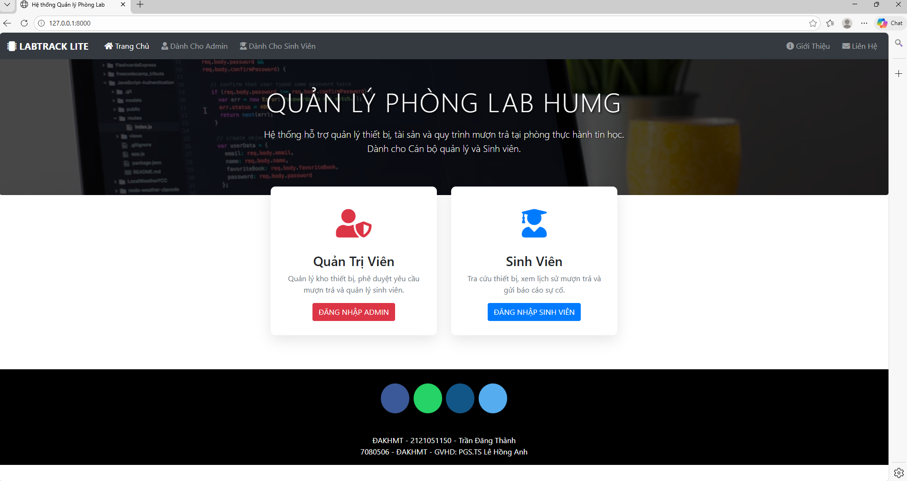
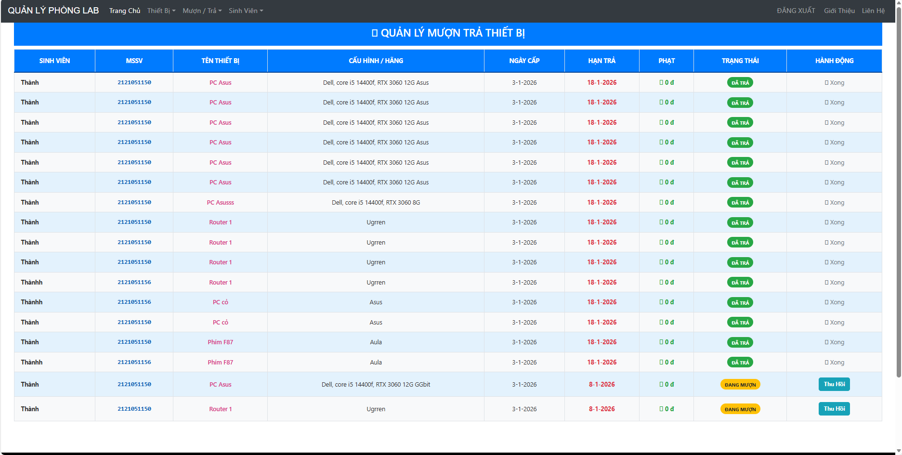
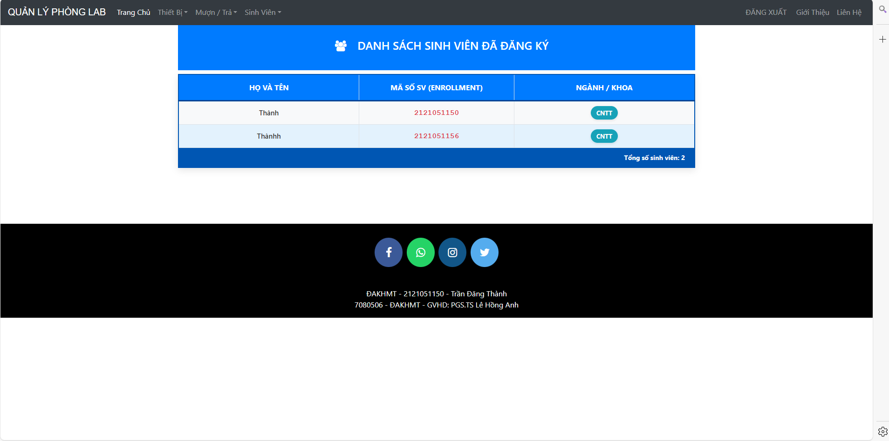
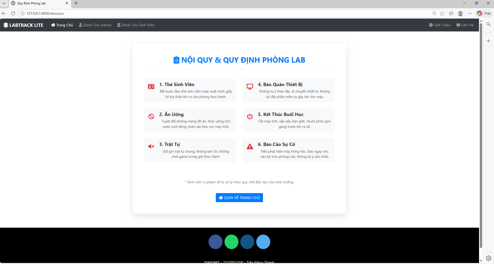

# 🖥️ LABTRACK LITE - HỆ THỐNG QUẢN LÝ PHÒNG LAB (HUMG)

**LabTrack Lite** là hệ thống quản lý thiết bị và tài sản phòng thực hành (Phòng Lab) dành cho trường Đại học Mỏ - Địa chất. Hệ thống giúp Admin quản lý kho thiết bị CNTT và theo dõi quá trình mượn trả của Sinh viên một cách trực quan, chính xác.

---

## 📸 1. HÌNH ẢNH DỰ ÁN (SCREENSHOTS)

### 🏠 Trang Chủ & Đăng Nhập
| Trang Chủ | Đăng Nhập Sinh Viên | Đăng Nhập Admin |
| :---: | :---: | :---: |
|  |  |  |

### 🛡️ Khu Vực Quản Trị Viên (Admin Dashboard)
**1. Quản lý Kho & Thêm Thiết Bị Mới**


**2. Quản Lý Mượn Trả & Phiếu Xuất**



**3. Quản Lý Sinh Viên**


### 🎓 Khu Vực Sinh Viên (Student Area)
**1. Theo Dõi Thiết Bị Đang Mượn**


**2. Tiện Ích Khác (Nội Quy & Phản Hồi)**



---

## 🚀 2. CHỨC NĂNG HỆ THỐNG (FEATURES)

### 🛡️ Dành Cho Admin
* **Đăng nhập/Bảo mật:** Truy cập hệ thống quản trị cao cấp.
* **Quản lý Kho:** Thêm, sửa, xóa, xem danh sách thiết bị (PC, Laptop, Router...).
* **Cấp Phát (Xuất Kho):** Tạo phiếu mượn thiết bị cho sinh viên.
* **Theo Dõi:** Xem danh sách thiết bị đang được mượn, ngày cấp và hạn trả.
* **Tính Phạt:** Hệ thống tự động tính tiền phạt (ví dụ: 10.000đ/ngày) nếu quá hạn.
* **Thu Hồi:** Xác nhận thiết bị đã được trả về kho.

### 🎓 Dành Cho Sinh Viên
* **Đăng ký/Đăng nhập:** Tạo tài khoản cá nhân.
* **Dashboard:** Xem danh sách thiết bị mình đang giữ.
* **Kiểm Tra:** Xem hạn trả và tiền phạt (nếu có).
* **Tiện ích:** Xem nội quy, gửi phản hồi báo lỗi cho Admin.

---

## ⚙️ 3. HƯỚNG DẪN CÀI ĐẶT & CHẠY DỰ ÁN

### Bước 1: Cài đặt môi trường
* Cài đặt Python (Phiên bản 3.7 trở lên). *Lưu ý: Tích vào ô "Add Python to PATH" khi cài đặt.*
* Mở **Terminal** (hoặc CMD) tại thư mục dự án.

### Bước 2: Cài đặt thư viện
Chạy lệnh sau để cài các gói cần thiết:
```bash
pip install -r requirements.txt
```
### Bước 3: Khởi tạo Cơ sở dữ liệu
Chạy lần lượt 2 lệnh sau:

```Bash
python manage.py makemigrations
python manage.py migrate
```
### Bước 4: Tạo tài khoản Admin
Để truy cập trang quản trị, bạn cần tạo tài khoản Superuser:
```Bash
python manage.py createsuperuser
(Nhập username, password tùy ý).
```
### Bước 5: Khởi động Server
```Bash

python manage.py runserver
```
Sau đó mở trình duyệt và truy cập:
```Bash
http://127.0.0.1:8000/
```
## 📧 4. CẤU HÌNH LIÊN HỆ (Gửi Email)
Để chức năng "Gửi phản hồi" hoạt động, hãy sửa file settings.py:

Python

EMAIL_HOST_USER = 'trandangthanh@gmail.com'
EMAIL_HOST_PASSWORD = '123'
EMAIL_RECEIVING_USER = 'trandangthanh3823@gmail.com'
## 👨‍💻 Tác Giả
Phát triển bởi: Trần Đăng Thành

MSSV: 2121051150

Lớp: K66 - HUMG (Đại học Mỏ - Địa chất)

Dự án: LabTrack Lite
